# Makefile Documentation
> *Auto-generated by [makefile2doc](https://github.com/Merlin-Clos/makefile2doc)*

## Cheat Sheet
| Command | Category | Description |
| :--- | :--- | :--- |
| [`make up`](#cmd-up) | [Development](#cat-development) | Start all development containers |
| [`make up-frontend`](#cmd-up-frontend) | [Development](#cat-development) | Start the frontend container with Vite hot reload |
| [`make up-backend`](#cmd-up-backend) | [Development](#cat-development) | Start the backend and PostgreSQL containers |
| [`make up-db`](#cmd-up-db) | [Development](#cat-development) | Start only the PostgreSQL container |
| [`make run-backend`](#cmd-run-backend) | [Development](#cat-development) | Run the backend in development mode |
| [`make run-backend-release`](#cmd-run-backend-release) | [Development](#cat-development) | Run the backend in release mode |
| [`make run-backend-error`](#cmd-run-backend-error) | [Development](#cat-development) | Run the backend with error-only logging |
| [`make down`](#cmd-down) | [Development](#cat-development) | Stop all containers |
| [`make down-frontend`](#cmd-down-frontend) | [Development](#cat-development) | Stop the frontend container |
| [`make down-backend`](#cmd-down-backend) | [Development](#cat-development) | Stop the backend container |
| [`make down-db`](#cmd-down-db) | [Development](#cat-development) | Stop the PostgreSQL container |
| [`make restart`](#cmd-restart) | [Development](#cat-development) | Restart all development containers |
| [`make restart-frontend`](#cmd-restart-frontend) | [Development](#cat-development) | Restart the frontend container |
| [`make restart-backend`](#cmd-restart-backend) | [Development](#cat-development) | Restart the backend and PostgreSQL containers |
| [`make restart-db`](#cmd-restart-db) | [Development](#cat-development) | Restart the PostgreSQL container |
| [`make init-db`](#cmd-init-db) | [Database](#cat-database) | Apply database migrations and load demo data |
| [`make seed-db`](#cmd-seed-db) | [Database](#cat-database) | Load demo artists, albums, and songs |
| [`make reset-db`](#cmd-reset-db) | [Database](#cat-database) | Recreate the database schema and reload demo data |
| [`make generate-clorinde`](#cmd-generate-clorinde) | [Database](#cat-database) | Regenerate Clorinde Rust query types from SQL files |
| [`make export-db`](#cmd-export-db) | [Database](#cat-database) | Export PostgreSQL data to a SQL file |
| [`make import-db`](#cmd-import-db) | [Database](#cat-database) | Import a SQL file into PostgreSQL |
| [`make check-backend`](#cmd-check-backend) | [Quality](#cat-quality) | Check that the backend compiles |
| [`make lint`](#cmd-lint) | [Quality](#cat-quality) | Run backend formatting and Clippy checks used by CI |
| [`make lint-backend`](#cmd-lint-backend) | [Quality](#cat-quality) | Run Clippy on the backend |
| [`make fmt-backend`](#cmd-fmt-backend) | [Quality](#cat-quality) | Format backend Rust code |
| [`make fmt-check-backend`](#cmd-fmt-check-backend) | [Quality](#cat-quality) | Check backend Rust formatting |
| [`make fix-backend`](#cmd-fix-backend) | [Quality](#cat-quality) | Apply automatic Rust fixes to the backend |
| [`make test`](#cmd-test) | [Quality](#cat-quality) | Run all backend tests |
| [`make build-frontend`](#cmd-build-frontend) | [Build](#cat-build) | Build frontend assets in Docker for Tauri |
| [`make build-tauri`](#cmd-build-tauri) | [Build](#cat-build) | Build Linux desktop packages on the host |
| [`make build-prod`](#cmd-build-prod) | [Build](#cat-build) | Build the production backend image |
| [`make prod`](#cmd-prod) | [Build](#cat-build) | Build and start the production backend and PostgreSQL services |
| [`make sh-frontend`](#cmd-sh-frontend) | [Shell](#cat-shell) | Open a shell in the frontend container |
| [`make sh-backend`](#cmd-sh-backend) | [Shell](#cat-shell) | Open a shell in the backend container |
| [`make sh-db`](#cmd-sh-db) | [Shell](#cat-shell) | Open a PostgreSQL shell |
| [`make clear`](#cmd-clear) | [Cleanup](#cat-cleanup) | Delete all application containers, images, and data volumes |
| [`make clear-frontend`](#cmd-clear-frontend) | [Cleanup](#cat-cleanup) | Delete the frontend container, image, and dependency volume |
| [`make clear-backend`](#cmd-clear-backend) | [Cleanup](#cat-cleanup) | Delete backend containers and images |
| [`make clear-db`](#cmd-clear-db) | [Cleanup](#cat-cleanup) | Delete PostgreSQL containers, images, and data volumes |
| [`make clean-git`](#cmd-clean-git) | [Cleanup](#cat-cleanup) | Delete local branches whose remote branch was removed |
| [`make tag`](#cmd-tag) | [Release](#cat-release) | Create an annotated version tag, for example TAG=v1.2.3 |
| [`make docs`](#cmd-docs) | [Documentation](#cat-documentation) | Generate Markdown documentation from the Makefile |

---

## Workflow Graph

```mermaid
flowchart LR
    subgraph Development[Development]
        up(up)
        up-frontend(up-frontend)
        up-backend(up-backend)
        up-db(up-db)
        run-backend(run-backend)
        run-backend-release(run-backend-release)
        run-backend-error(run-backend-error)
        down(down)
        down-frontend(down-frontend)
        down-backend(down-backend)
        down-db(down-db)
        restart(restart)
        restart-frontend(restart-frontend)
        restart-backend(restart-backend)
        restart-db(restart-db)
    end
    style Development fill:transparent,stroke-dasharray: 5 5
    classDef cat0 fill:#E1F5FE,stroke:#01579B,stroke-width:2px,color:#000;
    class up cat0
    class up-frontend cat0
    class up-backend cat0
    class up-db cat0
    class run-backend cat0
    class run-backend-release cat0
    class run-backend-error cat0
    class down cat0
    class down-frontend cat0
    class down-backend cat0
    class down-db cat0
    class restart cat0
    class restart-frontend cat0
    class restart-backend cat0
    class restart-db cat0
    subgraph Database[Database]
        init-db(init-db)
        seed-db(seed-db)
        reset-db(reset-db)
        generate-clorinde(generate-clorinde)
        export-db(export-db)
        import-db(import-db)
    end
    style Database fill:transparent,stroke-dasharray: 5 5
    classDef cat1 fill:#E8F5E9,stroke:#1B5E20,stroke-width:2px,color:#000;
    class init-db cat1
    class seed-db cat1
    class reset-db cat1
    class generate-clorinde cat1
    class export-db cat1
    class import-db cat1
    subgraph Quality[Quality]
        check-backend(check-backend)
        lint(lint)
        lint-backend(lint-backend)
        fmt-backend(fmt-backend)
        fmt-check-backend(fmt-check-backend)
        fix-backend(fix-backend)
        test(test)
    end
    style Quality fill:transparent,stroke-dasharray: 5 5
    classDef cat2 fill:#FFF3E0,stroke:#E65100,stroke-width:2px,color:#000;
    class check-backend cat2
    class lint cat2
    class lint-backend cat2
    class fmt-backend cat2
    class fmt-check-backend cat2
    class fix-backend cat2
    class test cat2
    subgraph Build[Build]
        build-frontend(build-frontend)
        build-tauri(build-tauri)
        build-prod(build-prod)
        prod(prod)
    end
    style Build fill:transparent,stroke-dasharray: 5 5
    classDef cat3 fill:#F3E5F5,stroke:#4A148C,stroke-width:2px,color:#000;
    class build-frontend cat3
    class build-tauri cat3
    class build-prod cat3
    class prod cat3
    subgraph Shell[Shell]
        sh-frontend(sh-frontend)
        sh-backend(sh-backend)
        sh-db(sh-db)
    end
    style Shell fill:transparent,stroke-dasharray: 5 5
    classDef cat4 fill:#FFEBEE,stroke:#B71C1C,stroke-width:2px,color:#000;
    class sh-frontend cat4
    class sh-backend cat4
    class sh-db cat4
    subgraph Cleanup[Cleanup]
        clear(clear)
        clear-frontend(clear-frontend)
        clear-backend(clear-backend)
        clear-db(clear-db)
        clean-git(clean-git)
    end
    style Cleanup fill:transparent,stroke-dasharray: 5 5
    classDef cat5 fill:#ECEFF1,stroke:#263238,stroke-width:2px,color:#000;
    class clear cat5
    class clear-frontend cat5
    class clear-backend cat5
    class clear-db cat5
    class clean-git cat5
    subgraph Release[Release]
        tag(tag)
    end
    style Release fill:transparent,stroke-dasharray: 5 5
    classDef cat6 fill:#E1F5FE,stroke:#01579B,stroke-width:2px,color:#000;
    class tag cat6
    subgraph Documentation[Documentation]
        docs(docs)
    end
    style Documentation fill:transparent,stroke-dasharray: 5 5
    classDef cat7 fill:#E8F5E9,stroke:#1B5E20,stroke-width:2px,color:#000;
    class docs cat7

    up --> up-backend
    up --> up-frontend
    run-backend --> up-backend
    run-backend-release --> up-backend
    run-backend-error --> up-backend
    restart --> down
    restart --> up
    restart-frontend --> down-frontend
    restart-frontend --> up-frontend
    restart-backend --> down-backend
    restart-backend --> up-backend
    restart-db --> down-db
    restart-db --> up-db
    init-db --> up-backend
    seed-db --> up-backend
    reset-db --> up-backend
    generate-clorinde --> init-db
    check-backend --> up-backend
    lint --> up-backend
    lint-backend --> up-backend
    fmt-backend --> up-backend
    fmt-check-backend --> up-backend
    fix-backend --> up-backend
    test --> up-backend
    build-tauri --> build-frontend
    prod --> build-prod
    clear --> clear-frontend
    clear --> clear-backend
    clear --> clear-db
```

---

## Section Details

### Development
| Command | Description | Dependencies | Required Variables |
| :--- | :--- | :--- | :--- |
| `make up` | Start all development containers | `up-backend`, `up-frontend` | - |
| `make up-frontend` | Start the frontend container with Vite hot reload | - | - |
| `make up-backend` | Start the backend and PostgreSQL containers | - | - |
| `make up-db` | Start only the PostgreSQL container | - | - |
| `make run-backend` | Run the backend in development mode | `up-backend` | - |
| `make run-backend-release` | Run the backend in release mode | `up-backend` | - |
| `make run-backend-error` | Run the backend with error-only logging | `up-backend` | - |
| `make down` | Stop all containers | - | - |
| `make down-frontend` | Stop the frontend container | - | - |
| `make down-backend` | Stop the backend container | - | - |
| `make down-db` | Stop the PostgreSQL container | - | - |
| `make restart` | Restart all development containers | `down`, `up` | - |
| `make restart-frontend` | Restart the frontend container | `down-frontend`, `up-frontend` | - |
| `make restart-backend` | Restart the backend and PostgreSQL containers | `down-backend`, `up-backend` | - |
| `make restart-db` | Restart the PostgreSQL container | `down-db`, `up-db` | - |

### Database
| Command | Description | Dependencies | Required Variables |
| :--- | :--- | :--- | :--- |
| `make init-db` | Apply database migrations and load demo data | `up-backend` | - |
| `make seed-db` | Load demo artists, albums, and songs | `up-backend` | - |
| `make reset-db` | Recreate the database schema and reload demo data | `up-backend` | - |
| `make generate-clorinde` | Regenerate Clorinde Rust query types from SQL files | `init-db` | - |
| `make export-db` | Export PostgreSQL data to a SQL file | - | - |
| `make import-db` | Import a SQL file into PostgreSQL | - | - |

### Quality
| Command | Description | Dependencies | Required Variables |
| :--- | :--- | :--- | :--- |
| `make check-backend` | Check that the backend compiles | `up-backend` | - |
| `make lint` | Run backend formatting and Clippy checks used by CI | `up-backend` | - |
| `make lint-backend` | Run Clippy on the backend | `up-backend` | - |
| `make fmt-backend` | Format backend Rust code | `up-backend` | - |
| `make fmt-check-backend` | Check backend Rust formatting | `up-backend` | - |
| `make fix-backend` | Apply automatic Rust fixes to the backend | `up-backend` | - |
| `make test` | Run all backend tests | `up-backend` | - |

### Build
| Command | Description | Dependencies | Required Variables |
| :--- | :--- | :--- | :--- |
| `make build-frontend` | Build frontend assets in Docker for Tauri | - | - |
| `make build-tauri` | Build Linux desktop packages on the host | `build-frontend` | - |
| `make build-prod` | Build the production backend image | - | - |
| `make prod` | Build and start the production backend and PostgreSQL services | `build-prod` | - |

### Shell
| Command | Description | Dependencies | Required Variables |
| :--- | :--- | :--- | :--- |
| `make sh-frontend` | Open a shell in the frontend container | - | - |
| `make sh-backend` | Open a shell in the backend container | - | - |
| `make sh-db` | Open a PostgreSQL shell | - | - |

### Cleanup
| Command | Description | Dependencies | Required Variables |
| :--- | :--- | :--- | :--- |
| `make clear` | Delete all application containers, images, and data volumes | `clear-frontend`, `clear-backend`, `clear-db` | - |
| `make clear-frontend` | Delete the frontend container, image, and dependency volume | - | - |
| `make clear-backend` | Delete backend containers and images | - | - |
| `make clear-db` | Delete PostgreSQL containers, images, and data volumes | - | - |
| `make clean-git` | Delete local branches whose remote branch was removed | - | - |

### Release
| Command | Description | Dependencies | Required Variables |
| :--- | :--- | :--- | :--- |
| `make tag` | Create an annotated version tag, for example TAG=v1.2.3 | - | `TAG` |

### Documentation
| Command | Description | Dependencies | Required Variables |
| :--- | :--- | :--- | :--- |
| `make docs` | Generate Markdown documentation from the Makefile | - | - |
