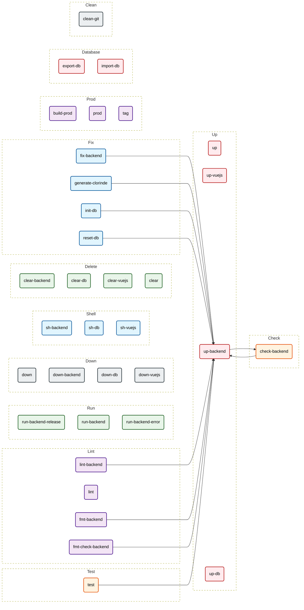

# Makefile Documentation
> *Auto-generated by [makefile2doc](https://github.com/Merlin-Clos/makefile2doc)*

## Cheat Sheet
| Command | Category | Description |
| :--- | :--- | :--- |
| [`make fix-backend`](#fix) | Fix | Auto-fix Rust backend issues |
| [`make generate-clorinde`](#fix) | Fix | Generate Clorinde query types from SQL files (requires init-db first) |
| [`make init-db`](#fix) | Fix | Apply database migrations |
| [`make reset-db`](#fix) | Fix | Drop application tables and re-apply database migrations |
| [`make run-backend-release`](#run) | Run | Run backend in release mode |
| [`make run-backend`](#run) | Run | Run backend in development mode |
| [`make run-backend-error`](#run) | Run | Run backend with error logging only |
| [`make check-backend`](#check) | Check | Check Rust backend code (fast compilation) |
| [`make lint-backend`](#lint) | Lint | Lint Rust backend code with Clippy |
| [`make lint`](#lint) | Lint | Run CI-equivalent backend lint checks |
| [`make fmt-backend`](#lint) | Lint | Format Rust backend code |
| [`make fmt-check-backend`](#lint) | Lint | Check Rust backend code formatting |
| [`make up`](#up) | Up | Start all services (backend + postgres) |
| [`make up-vuejs`](#up) | Up | Start frontend with hot-reload |
| [`make up-backend`](#up) | Up | Start backend service (with postgres dependency) |
| [`make up-db`](#up) | Up | Start postgres service only |
| [`make down`](#down) | Down | Stop all services |
| [`make down-backend`](#down) | Down | Stop backend service |
| [`make down-db`](#down) | Down | Stop postgres service |
| [`make down-vuejs`](#down) | Down | Stop frontend service |
| [`make sh-backend`](#shell) | Shell | Open backend container shell |
| [`make sh-db`](#shell) | Shell | Open postgres container shell (psql) |
| [`make sh-vuejs`](#shell) | Shell | Open frontend container shell |
| [`make clear-backend`](#delete) | Delete | Delete backend container and image |
| [`make clear-db`](#delete) | Delete | Delete postgres container, image, and data volume |
| [`make clear-vuejs`](#delete) | Delete | Delete frontend container and image |
| [`make clear`](#delete) | Delete | Delete all containers, images, and volumes |
| [`make test`](#test) | Test | Run backend tests |
| [`make build-prod`](#prod) | Prod | Build and tag backend production image |
| [`make prod`](#prod) | Prod | Build, tag, and run backend in production mode |
| [`make tag`](#prod) | Prod | Create a version tag (use TAG=v1.2.3 make tag) |
| [`make export-db`](#database) | Database | Export postgres database to a SQL file |
| [`make import-db`](#database) | Database | Import a SQL file into postgres database |
| [`make clean-git`](#clean) | Clean | Clean deleted git branches |

---

## Workflow Graph

---

## Section Details

### Fix
| Command | Description | Dependencies | Required Variables |
| :--- | :--- | :--- | :--- |
| `make fix-backend` | Auto-fix Rust backend issues | `up-backend` | - |
| `make generate-clorinde` | Generate Clorinde query types from SQL files (requires init-db first) | `up-backend` | - |
| `make init-db` | Apply database migrations | `up-backend` | - |
| `make reset-db` | Drop application tables and re-apply database migrations | `up-backend` | - |

### Run
| Command | Description | Dependencies | Required Variables |
| :--- | :--- | :--- | :--- |
| `make run-backend-release` | Run backend in release mode | - | - |
| `make run-backend` | Run backend in development mode | - | - |
| `make run-backend-error` | Run backend with error logging only | - | - |

### Check
| Command | Description | Dependencies | Required Variables |
| :--- | :--- | :--- | :--- |
| `make check-backend` | Check Rust backend code (fast compilation) | `up-backend` | - |

### Lint
| Command | Description | Dependencies | Required Variables |
| :--- | :--- | :--- | :--- |
| `make lint-backend` | Lint Rust backend code with Clippy | `up-backend` | - |
| `make lint` | Run CI-equivalent backend lint checks | - | - |
| `make fmt-backend` | Format Rust backend code | `up-backend` | - |
| `make fmt-check-backend` | Check Rust backend code formatting | `up-backend` | - |

### Up
| Command | Description | Dependencies | Required Variables |
| :--- | :--- | :--- | :--- |
| `make up` | Start all services (backend + postgres) | - | - |
| `make up-vuejs` | Start frontend with hot-reload | - | - |
| `make up-backend` | Start backend service (with postgres dependency) | `check-backend` | - |
| `make up-db` | Start postgres service only | - | - |

### Down
| Command | Description | Dependencies | Required Variables |
| :--- | :--- | :--- | :--- |
| `make down` | Stop all services | - | - |
| `make down-backend` | Stop backend service | - | - |
| `make down-db` | Stop postgres service | - | - |
| `make down-vuejs` | Stop frontend service | - | - |

### Shell
| Command | Description | Dependencies | Required Variables |
| :--- | :--- | :--- | :--- |
| `make sh-backend` | Open backend container shell | - | - |
| `make sh-db` | Open postgres container shell (psql) | - | - |
| `make sh-vuejs` | Open frontend container shell | - | - |

### Delete
| Command | Description | Dependencies | Required Variables |
| :--- | :--- | :--- | :--- |
| `make clear-backend` | Delete backend container and image | - | - |
| `make clear-db` | Delete postgres container, image, and data volume | - | - |
| `make clear-vuejs` | Delete frontend container and image | - | - |
| `make clear` | Delete all containers, images, and volumes | - | - |

### Test
| Command | Description | Dependencies | Required Variables |
| :--- | :--- | :--- | :--- |
| `make test` | Run backend tests | `up-backend` | - |

### Prod
| Command | Description | Dependencies | Required Variables |
| :--- | :--- | :--- | :--- |
| `make build-prod` | Build and tag backend production image | - | - |
| `make prod` | Build, tag, and run backend in production mode | - | - |
| `make tag` | Create a version tag (use TAG=v1.2.3 make tag) | - | - |

### Database
| Command | Description | Dependencies | Required Variables |
| :--- | :--- | :--- | :--- |
| `make export-db` | Export postgres database to a SQL file | - | `EXPORT_FILE` |
| `make import-db` | Import a SQL file into postgres database | - | `sqlfile` |

### Clean
| Command | Description | Dependencies | Required Variables |
| :--- | :--- | :--- | :--- |
| `make clean-git` | Clean deleted git branches | - | - |
