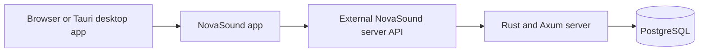

# NovaSound

## Project Overview

NovaSound app is the music application's browser and desktop client.

The current product foundation centers on three catalog entities:

- Artists
- Albums
- Songs

The NovaSound server stores the catalog in PostgreSQL and exposes the service API.
This repository owns the lightweight web interface, which runs in a browser and can
be packaged in a native desktop shell; it consumes that server as an external
boundary.

## Direction and Goals

NovaSound is intended to grow from a reliable catalog service into a richer music product. The immediate objective is to establish maintainable technical foundations before adding more product complexity.

The project aims to:

- Maintain a consistent, searchable music catalog.
- Provide a strongly typed API for application clients.
- Keep database access explicit, safe, and easy to evolve.
- Offer a fast web interface with progressively updated content.
- Support a Linux desktop application without duplicating the frontend.
- Create a platform that can later support playback, user libraries, listening history, music analytics, recommendations, and external music-service integrations.

These latter capabilities are future directions, not claims about features already available in the application.

## Architecture

The app communicates with the separately owned NovaSound server API. The server implements business logic, exposes Connect RPC services through Axum, and owns PostgreSQL persistence. API definitions and database queries are maintained in the server repository; see the [server architecture](../../../novasound-server/project/docs/ARCHITECTURE.md) for its implementation details.

## Technology Choices

### NovaSound Server Boundary

The separately maintained NovaSound server uses Rust because it combines high performance with memory safety and strong compile-time guarantees. A music platform can grow to handle many concurrent requests, long-running operations, and data-intensive workloads; Rust provides a dependable foundation for that evolution while avoiding garbage-collection pauses.

Its type system also helps make domain rules and error paths explicit. This is particularly useful for a catalog where artists, albums, songs, identifiers, dates, and validation rules must remain consistent across the API and database layers. The app consumes the resulting API contract rather than owning these internals.

### Tokio for Asynchronous Execution

Tokio is Rust's asynchronous runtime. It allows the backend to handle concurrent HTTP and database operations efficiently without blocking a thread for every request. This is a suitable model for an API that will serve catalog queries and, later, potentially streaming-related workloads.

### Axum and axum-server for HTTP Services

Axum is the HTTP framework used by NovaSound. It is built for Tokio and provides typed request handling, routing, middleware, and integration with the Rust ecosystem. `axum-server` supplies the server runtime used to bind and serve the application.

Together, they keep the HTTP layer small, asynchronous, and compatible with the typed service implementation.

### Connect RPC and Protobuf for the API Contract

NovaSound uses Connect RPC with Protobuf contracts. Protobuf files define request and response shapes independently from the service implementation, making the API contract explicit and versionable.

This approach was chosen to:

- Keep client-server data structures consistent.
- Generate service bindings instead of maintaining duplicate hand-written types.
- Make API changes reviewable through contract changes.
- Preserve flexibility for multiple clients, including browser and desktop applications.

The Protobuf files under `novasound-server/code/contracts/proto/` are the source of truth for the API.

### PostgreSQL for Persistent Data

PostgreSQL stores the music catalog and its relationships. It is a mature relational database with strong transactional guarantees, indexing, constraints, and query capabilities.

A relational database is appropriate for NovaSound because an artist can own many albums and songs, while a song may optionally belong to an album. PostgreSQL enforces these relationships at the data layer and provides a scalable base for future catalog, library, and analytics features.

In development, the database data is stored in the Docker named volume `novasound_postgres_data`, so it persists when containers are stopped or recreated.

### deadpool-postgres and tokio-postgres for Database Access

The backend uses `deadpool-postgres` and `tokio-postgres`. The connection pool reuses PostgreSQL connections rather than opening one for every request, while `tokio-postgres` provides asynchronous database communication compatible with Tokio.

This combination supports responsive database access while keeping connection management centralized.

### Clorinde for Generated SQL Queries

Database queries are written as SQL files and turned into Rust code by Clorinde. This keeps SQL visible and reviewable while giving the Rust application typed query interfaces.

Clorinde was selected to avoid hiding complex database behavior behind a generic ORM. The project retains PostgreSQL's SQL capabilities while reducing manual mapping and type mismatch risks in service code.

### HTMX for the Frontend Interaction Model

The frontend uses HTMX for dynamic interactions. HTMX lets the browser request and replace small HTML fragments, allowing the application to feel responsive without requiring a large single-page application framework.

This choice keeps the frontend lightweight and aligns well with server-rendered or fragment-oriented interfaces. It is useful for catalog views, navigation, search results, and incremental UI updates.

### Vite and Bun for Frontend Development

Vite provides the frontend development server and build pipeline. Bun installs dependencies and runs frontend scripts locally.

They were chosen for a fast development loop: quick startup, file watching, and a simple production build.

### Tauri for the Desktop Application

Tauri is the intended native desktop shell for NovaSound. It loads the same frontend used in the browser, using the operating system's WebView instead of shipping a separate Chromium runtime.

This keeps the desktop application smaller and more resource-efficient than many Electron-based applications, while allowing NovaSound to reuse its web UI. The native shell runs on the Linux host during development and consumes the external server API when live data is needed.

### Docker Compose for Local Infrastructure

The app's Docker configuration runs only the Bun/Vite development service. The server repository owns the backend and PostgreSQL Docker stack.

This reduces setup differences between contributors while keeping app configuration separate from server credentials and database lifecycle.

### Make for Development Commands

The Makefile provides a stable set of project commands, including:

- `make dev` to start the browser development server.
- `make build` to build browser assets.
- `make build-tauri` to build the desktop application.

Using named commands makes the expected workflow discoverable and avoids requiring contributors to remember long Docker or Cargo invocations.

## Current State

NovaSound app currently provides the client-side basis for artist, album, and song catalog experiences:

- A lightweight HTMX frontend development setup.
- A browser client and Tauri desktop shell.
- A reserved, not-yet-built static demo boundary.
- An external HTTP boundary to NovaSound server; the current catalogue request is
  `GET /web/artists` using `VITE_API_BASE_URL`.
- No browser test script or test suite at present; `bun run build` is the available
  browser validation command.

The product is still in its foundation phase. Playback, account management, personal libraries, recommendations, streaming delivery, and production-ready desktop packaging remain future work.

## Development Principles

NovaSound favors explicit contracts and maintainable boundaries:

- The external server API defines the client-server contract.
- App Docker configuration remains independent from server credentials and persistence.
- The web frontend remains reusable by the native desktop shell.

This structure is intended to let NovaSound add product features without sacrificing reliability, performance, or clarity of ownership between the frontend, API, and database layers.
