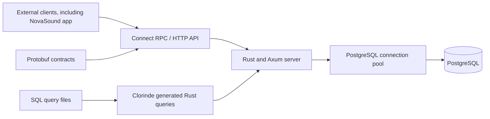

# NovaSound

## Project Overview

NovaSound server provides the API and persistence foundation for the NovaSound
catalogue application.

The current product foundation centers on three catalog entities:

- Artists
- Albums
- Songs

NovaSound server stores this catalog in PostgreSQL and exposes it through
ConnectRPC contracts. The separately maintained NovaSound app is an external
consumer that provides the browser interface and desktop shell.

## Direction and Goals

NovaSound is intended to grow from a reliable catalog service into a richer music product. The immediate objective is to establish maintainable technical foundations before adding more product complexity.

The project aims to:

- Maintain a consistent, searchable music catalog.
- Provide a strongly typed API for application clients.
- Keep database access explicit, safe, and easy to evolve.
- Offer a fast web interface with progressively updated content.
- Support a Linux desktop application without duplicating the frontend.
- Create a platform that can later support playback, user libraries, listening history, music analytics, recommendations, and external music-service integrations.

These latter capabilities are future directions, not claims about features already available in the application.

## Architecture

External clients, including NovaSound app, communicate with the Rust server through its API. The server implements the business logic and exposes Connect RPC services through Axum. PostgreSQL is the persistent source of truth. API definitions and database queries are generated from explicit source files to reduce drift between the application layers.

## Technology Choices

### Rust for the Backend

Rust is used for the backend because it combines high performance with memory safety and strong compile-time guarantees. A music platform can grow to handle many concurrent requests, long-running operations, and data-intensive workloads; Rust provides a dependable foundation for that evolution while avoiding garbage-collection pauses.

Its type system also helps make domain rules and error paths explicit. This is particularly useful for a catalog where artists, albums, songs, identifiers, dates, and validation rules must remain consistent across the API and database layers.

### Tokio for Asynchronous Execution

Tokio is Rust's asynchronous runtime. It allows the backend to handle concurrent HTTP and database operations efficiently without blocking a thread for every request. This is a suitable model for an API that will serve catalog queries and, later, potentially streaming-related workloads.

### Axum and axum-server for HTTP Services

Axum is the HTTP framework used by NovaSound. It is built for Tokio and provides typed request handling, routing, middleware, and integration with the Rust ecosystem. `axum-server` supplies the server runtime used to bind and serve the application.

Together, they keep the HTTP layer small, asynchronous, and compatible with the typed service implementation.

### Connect RPC and Protobuf for the API Contract

NovaSound uses Connect RPC with Protobuf contracts. Protobuf files define request and response shapes independently from the service implementation, making the API contract explicit and versionable.

This approach was chosen to:

- Keep client-server data structures consistent.
- Generate service bindings instead of maintaining duplicate hand-written types.
- Make API changes reviewable through contract changes.
- Preserve flexibility for multiple clients, including browser and desktop applications.

The Protobuf files under `code/contracts/proto/` are the source of truth for the API.

### PostgreSQL for Persistent Data

PostgreSQL stores the music catalog and its relationships. It is a mature relational database with strong transactional guarantees, indexing, constraints, and query capabilities.

A relational database is appropriate for NovaSound because an artist can own many albums and songs, while a song may optionally belong to an album. PostgreSQL enforces these relationships at the data layer and provides a scalable base for future catalog, library, and analytics features.

In development, the database data is stored in the Docker named volume `novasound_postgres_data`, so it persists when containers are stopped or recreated.

### deadpool-postgres and tokio-postgres for Database Access

The backend uses `deadpool-postgres` and `tokio-postgres`. The connection pool reuses PostgreSQL connections rather than opening one for every request, while `tokio-postgres` provides asynchronous database communication compatible with Tokio.

This combination supports responsive database access while keeping connection management centralized.

### Clorinde for Generated SQL Queries

Database queries are written as SQL files and turned into Rust code by Clorinde. This keeps SQL visible and reviewable while giving the Rust application typed query interfaces.

Clorinde was selected to avoid hiding complex database behavior behind a generic ORM. The project retains PostgreSQL's SQL capabilities while reducing manual mapping and type mismatch risks in service code.

### Docker Compose for Local Infrastructure

Docker Compose runs the server and PostgreSQL database. It provides a repeatable local environment and isolates development dependencies from the host machine.

This reduces setup differences between contributors and makes the database lifecycle, service networking, and environment variables predictable.

### Make for Development Commands

The Makefile provides a stable set of project commands, including:

- `make up` to start the server and database development stack.
- `make init-db` to apply migrations and load demo data.
- `make test` to run backend tests.
- `make lint` to run formatting and Clippy checks.
- `make check-backend` to type-check the server.

Using named commands makes the expected workflow discoverable and avoids requiring contributors to remember long Docker or Cargo invocations.

## Current State

NovaSound currently provides the technical basis for artist, album, and song catalog management:

- PostgreSQL-backed persistence.
- Database migrations and seeded demo data.
- Create, read, list, update, and delete operations for catalog resources.
- Connect RPC services generated from Protobuf contracts.
- Artist, album, and song ConnectRPC services defined in Protobuf.
- Three server-rendered `/web` HTML routes, including the artist fragment consumed
  by the app.
- A typed API consumed by external clients, including NovaSound app.
- Docker-based development services and Rust quality checks.

The product is still in its foundation phase. Playback, account management, personal libraries, recommendations, streaming delivery, and production-ready desktop packaging remain future work.

## Development Principles

NovaSound favors explicit contracts and maintainable boundaries:

- Protobuf defines the API contract.
- SQL defines database behavior.
- Generated code connects those definitions to typed Rust services.
- PostgreSQL remains the source of truth for persistent catalog data.
- Docker Compose makes development infrastructure repeatable.
- The web frontend remains reusable by the native desktop shell.

This structure is intended to let NovaSound add product features without sacrificing reliability, performance, or clarity of ownership between the frontend, API, and database layers.
